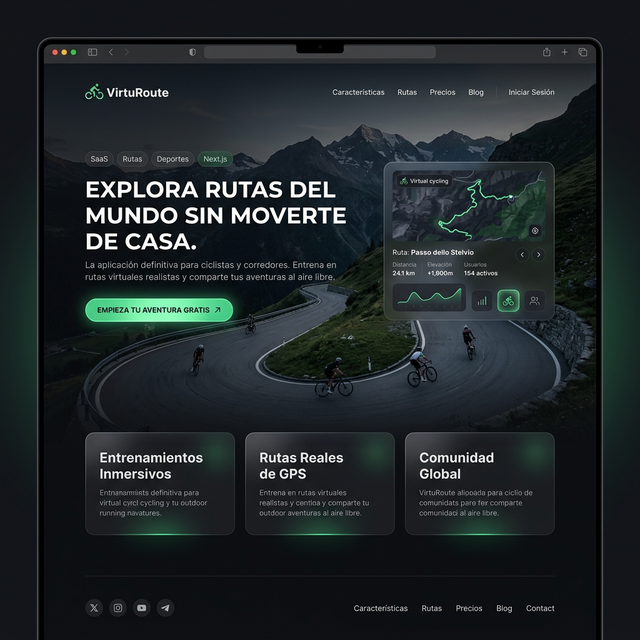
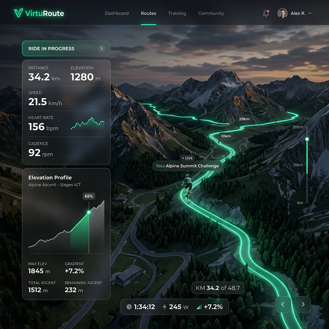

# 🌍 VirtuRoute - Premium Virtual Route SaaS


Bienvenido a **VirtuRoute**, una plataforma SaaS nivel *Ultra-Premium* diseñada para conectar a atletas outdoor, ciclistas de salón y exploradores con rutas mapeadas hiper-realistas en todo el planeta. 

Ya sea que busques desafiar el Paso de Mahoma en el Pirineo Aragonés o pedalear por los prados de los Dolomitas desde tu *Smart Trainer*, VirtuRoute procesa, vende y streamea el entorno ideal para ti.

🔗 **[Visita la aplicación en vivo aquí](https://virtu-route.vercel.app)**

---

## 📋 Tabla de Contenidos
- [Demo](#-demo-en-vivo)
- [Características](#-características)
- [Stack Tecnológico](#-stack-tecnológico)
- [Instalación](#-instalación)
- [Screenshots](#-screenshots)
- [Roadmap](#-roadmap)
- [Variables de Entorno](#-variables-de-entorno)
- [Contribuir](#-contribuir)
- [Licencia](#-licencia)

---

## 🌐 Demo en Vivo

Puedes explorar el proyecto desplegado a nivel mundial (vía Vercel) aquí:
👉 **[https://virtu-route.vercel.app](https://virtu-route.vercel.app)**

---

## 💎 Características
- **Animaciones Cinematográficas**: UI potenciada enteramente por `framer-motion` (Parallax scroll, fade-ins, hovers con glow radial).
- **Glassmorphism Inteligente**: Sidebars, navbars y tarjetas con efecto cristalino sobre la densa interfaz oscura.
- **Rutas GPX Reales**: Integración experta con Leaflet interactivo permitiendo visualizar trazados de rutas exactos con puntos de inicio y final precisos.
- **Modo Inmersivo (Lightbox)**: Zoom hiper-detallado sobre imágenes fotográficas exclusivas 4K a través de modales.
- **Dual Dashboard**: Paneles limpios y específicos tanto para el "Usuario Comprador" como para el "Atleta Creador".
- **Creador Studio**: Innovador componente web GIS que permite dibujar a mano alzada las coordenadas reales al subir nuevas rutas al ecosistema. 
- **Integrado para Monetizar**: Estructurado pensando en la futura escalabilidad a suscripciones con Stripe Connect (75/25 split).

---

## 🛠 Stack Tecnológico

| Capa | Tecnología | Descripción |
| :--- | :--- | :--- |
| **Framework** | Next.js 15 | App Router, Server Components y compilación rápida |
| **Lenguaje** | React 19 / TypeScript 5 | Tipado estático y UI basada en componentes avanzados |
| **Estilos** | Tailwind CSS v4 | Framework de utilidades para un diseño pixel-perfect |
| **Componentes** | shadcn/ui + Lucide | Sistema de diseño nativo y altamente personalizable |
| **Mapas GIS** | LeafletJS + react-leaflet | Renderizado de trazados GPX y tiles geográficos |
| **Animación** | framer-motion | Micro-interacciones y layouts fluidos |
| **Visualización**| yet-another-react-lightbox | Modales fotográficos inmersivos 4K |
| **Backend (Próx)**| Supabase | Base de datos PostgreSQL y flujos de autenticación |
| **Despliegue** | Vercel | Hosting serverless edge ultra rápido |

---

## 🚀 Instalación

El proyecto está diseñado para funcionar out-of-the-box sin necesidad de instalar bases de datos externas en la Fase actual MVP.

### 1. Clona el Repositorio
```bash
git clone https://github.com/nicco6482/Virtu-Route.git
cd Virtu-Route
```

### 2. Instala Dependencias
Usando `npm` o tu gestor favorito:
```bash
npm install
```

### 3. Levanta el Servidor de Desarrollo
```bash
npm run dev
```
La aplicación vivirá mágicamente en **[http://localhost:3000](http://localhost:3000)**. 

*(**Nota para desarrolladores**: Asegúrate de tener los dominios fotográficos aprobados en el `next.config.ts` o Next.js Image Component bloqueará su renderizado).*

---

## 📸 Screenshots

### Landing Page & Marketplace


### Ruta Interactiva y Modo Lightbox


---

## 🗺 Roadmap

El desarrollo de VirtuRoute está estructurado en fases. Los próximos pasos hacia la versión final de monetización incluyen:
- [ ] **Fase 5 - Backend & Auth**: Migración de las rutas estáticas (`rutas.ts`) a **Supabase** (PostgreSQL) y Autenticación de usuarios real (Creador/Comprador).
- [ ] **Fase 6 - Pagos Integrados**: Inserción del checkout con **Stripe Connect** para dividir y procesar cobros de 9.99€, depositando el 75% al creador de la ruta.
- [ ] **Fase 7 - Uploads Reales**: Motor de importación de archivos `.gpx` puros y multimedia, mandando a AWS/S3 Storage.
- [ ] **Fase 8 - Telemetría Indoor**: Conexión nativa con Smart Trainers (Rodillos) vía extensión Web Bluetooth API para sincronizar resistencia con % de elevación en pantalla.

---

## 🔐 Variables de Entorno

Para ejecutar la aplicación a nivel avanzado a medida que sumamos dependencias server-side, copia el archivo de base (si existe) o crea un `.env.local` con las siguientes claves sugeridas:

```env
# Ejemplo (No son necesarias para correr el MVP estático actual)
NEXT_PUBLIC_SUPABASE_URL=your_supabase_project_url
NEXT_PUBLIC_SUPABASE_ANON_KEY=your_supabase_anon_key
STRIPE_SECRET_KEY=your_stripe_test_key
NEXT_PUBLIC_STRIPE_PUBLISHABLE_KEY=your_stripe_public_key
```

---

## 🤝 Contribuir

¡Las contribuciones son increíblemente apreciadas! Si tienes una idea para potenciar los mapas Leaflet o descubres algún bug:
1. Haz un **Fork** del proyecto.
2. Crea tu Feature Branch (`git checkout -b feature/AmazingFeature`).
3. Haz Commit de tus cambios (`git commit -m 'feat: Add some AmazingFeature'`).
4. Haz Push a la rama (`git push origin feature/AmazingFeature`).
5. Abre un **Pull Request**.

Si el proyecto escala, consulta el archivo [CONTRIBUTING.md](./CONTRIBUTING.md) para más detalles.

---

## 📄 Licencia

Desarrollado con obsesión *pixel-perfect*. © 2026 VirtuRoute Inc. (Demo Portfolio).
Todos los derechos reservados sobre el código originario de este boilerplate. Las imágenes fotográficas insertas en este momento de desarrollo pertenecen a plataformas de stock (Unsplash, Alamy) provistas en la capa de prueba de datos en `rutas.ts`.

Distribuido bajo licencia MIT. Consulta el archivo `LICENSE` para más información.
